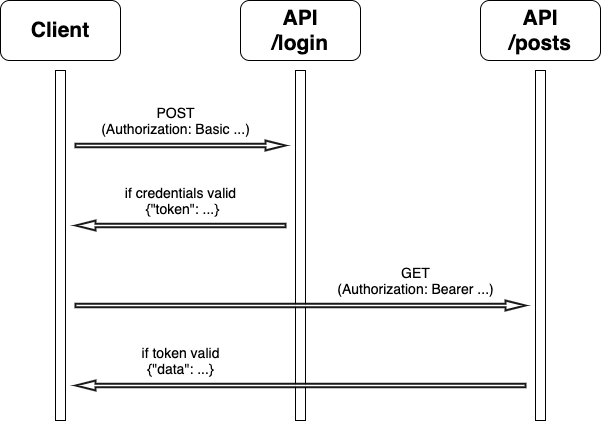

# Blog Authorization

As much as people talk about the internet as a medium for open communication, the real money is in controlling and restricting information.  As our blogging site has grown in popularity, we no longer want just anyone to be able to see the content.

You will be implementing an [Authentication/Authorization](https://www.okta.com/identity-101/authentication-vs-authorization/) solution for the blog.  [Here](https://developer.mozilla.org/en-US/docs/Web/HTTP/Authentication) is an overview of how that works for HTTP.

Your team's architect has given you the following [sequence diagram](http://www.tracemodeler.com/articles/a_quick_introduction_to_uml_sequence_diagrams/) that describes the basic authentication flow for your application: <br>
 <br>

Based on the sequence diagram, it appears that you will be using a simplified, pedagogically informed (you're welcome) version of the the normal HTTP authentication flow.

Once you have your client's credentials (username and password), you will:
1. Make a POST request to the `/login` endpoint that includes a properly formatted `Authorization` header using the "Basic" authentication scheme.
2. Handle the token that the server returns to you (the token is meant to be a representation of a [JWT](https://jwt.io/introduction), but will just be a random alphanumeric sequence).  Let's use our imaginations a bit and say the token can safely be kept in the browser's storage ([read more](https://dev.to/gkoniaris/how-to-securely-store-jwt-tokens-51cf) about why you shouldn't do that).
3. Once you have a valid token, you should be able to make a request to a protected endpoint.  As in step 1, you will send the credentials in an `Authorization` header, but you will use the "Bearer" authentication scheme instead.
4. If your token is valid, you will get those sweet, sweet blog posts.


## Implementation Details
Run `database/initialize_db.py` to get the database going.<br>
Run `server/server.py` to get the server running.

There are two routes in `server.py`.  They each have their own handler functions in `views.py`. 
`handle_login` should handle creating, saving, and sending the token (if the supplied credentials are valid).
`handle_posts` should return all the posts (already written).

(You can ignore the CORS-specific code, but if you'd like to know more about why it's [there...](https://stackoverflow.com/questions/29954037/why-is-an-options-request-sent-and-can-i-disable-it))

`handle_posts` is in charge of your protected resource.  Right now it is not protected.  You could, of course, write some code to `handle_posts` to take care of that, but then you'd have to add that same code to any other handlers.  We will avoid the tragedy that is repetition by writing a `login_required` decorator in `login.py`.  The `login_required` decorator is an ominous foreshadowing of [this](https://docs.djangoproject.com/en/3.2/topics/auth/default/#the-login-required-decorator).  It knows all about that thing you did that one time.

The `login_required` decorator should ensure that any requests to protected resources contain a valid token.


### Notes
You'll have to create tokens.  You can do whatever you like, but here is a suggestion:
```python
token = ''.join(random.choices(string.ascii_letters + string.digits, k=16))
```
Here are the plaintext passwords for the users:
- Bob: hello
- Jane: goodbye
- Sam: password

Here is how those passwords were encrypted:
```python
hashlib.sha256(PLAINTEXT_PASSWORD.encode()).hexdigest()
```
Feel free to restructure the code as you see fit.

Once again, Postman and DB Browser are your friends.
