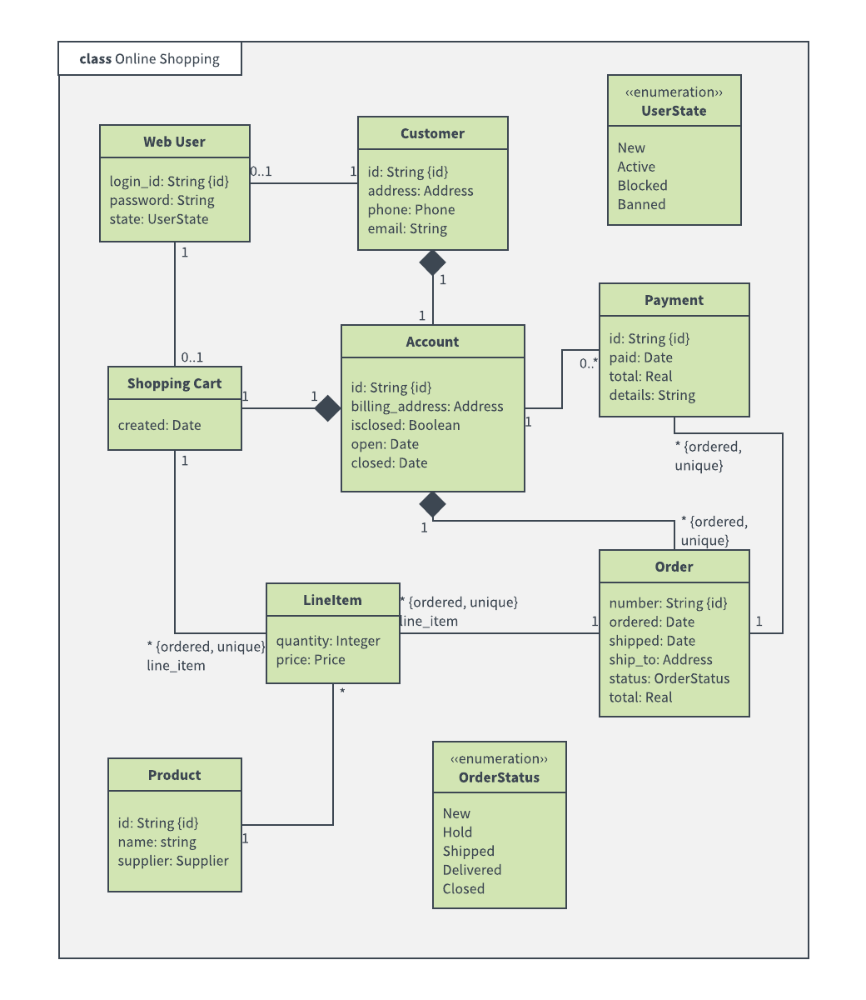

# Consulting Gig

## Scenario
Your team has just been hired to assess the design architecture for Netflix.  Eventually, you will be making recommendations for improvement, but for now your goal is merely to understand Netflix' current design.

After signing an NDA, you have been granted access to their source code.  Take some time to go through the code so you understand how everything works at a high level (i.e., What classes are there, what do they do, and how are they connected to each other?).

Once you feel like you understand how the code works together, diagram out the structure.  Your diagram should show all the important pieces and how they are related to each other.  You can use whatever you like, but here are a couple recommendations: [sketch.io](https://sketch.io/sketchpad/), [draw.io](https://app.diagrams.net/), or [Limnu](https://limnu.com/).  It doesn't have to be beautiful, just functional.

This is an example of the kind of diagram you should be shooting for:  
 

The above is a Unified Modeling Language (UML) diagram.  UML is a fairly standardized way of describing an application's structure.  You can read more [here](https://www.visual-paradigm.com/guide/uml-unified-modeling-language/what-is-class-diagram/). For this exercise, don't worry about the details; boxes and lines is fine.

Keep it simple, and remember they really only care about how everything is connected, so don't get bogged down in irrelevant detail.

No pressure or anything, but you are on a tight deadline and you'll be presenting your initial findings to the CIO of Netflix in 40 minutes.

Good luck!
